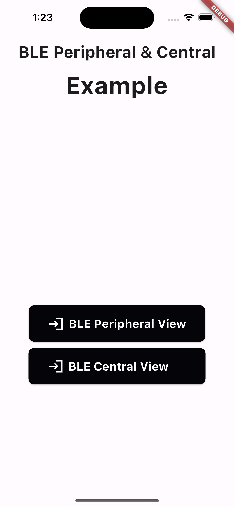

# flutter_ble_peripheral_central

"flutter_ble_peripheral_central plugin project"

## 1. Introduction

* This project is another initiative that is part of the process of exploring methods for data exchange between apps on cross-platforms using BLE.


* The project was initiated with the intention of enabling the same functionality on iOS and Android within Flutter, 
  by referencing the iOS/android native code from alexanderlavrushko's BLEProof-collection (https://github.com/alexanderlavrushko/BLEProof-collection) 
  and creating the flutter_ble_peripheral_central plugin project. 


* It operates on the latest versions of iOS and Android, and while it's straightforward for simple data exchange between apps via BLE, 
  for more complex device control, we recommend utilizing well-established libraries that have been verified and widely used. 

 
* Please note that the UUIDs and functionality lists are directly adopted from the BLEProof-collection.

## 2. Screenshots


| Home                                       | BLE Central                                       | BLE Peripheral                                     |
|--------------------------------------------|---------------------------------------------------|----------------------------------------------------|
|         |       |  |


## 3. Setup

**Android**

1) Add permission to your `AndroidManifest.xml`.
   ````xml
    <uses-permission android:name="android.permission.BLUETOOTH" />
    <uses-permission android:name="android.permission.BLUETOOTH_ADMIN" />
    <uses-permission android:name="android.permission.BLUETOOTH_SCAN" android:usesPermissionFlags="neverForLocation" />
    <uses-permission android:name="android.permission.BLUETOOTH_ADVERTISE" />
    <uses-permission android:name="android.permission.BLUETOOTH_CONNECT" />
    <uses-feature android:name="android.hardware.bluetooth" android:required="true"/>
    <uses-feature android:name="android.hardware.bluetooth_le" android:required="true"/>
    <uses-permission android:name="android.permission.ACCESS_BACKGROUND_LOCATION" />
    <uses-permission android:name="android.permission.ACCESS_FINE_LOCATION" />
    <uses-permission android:name="android.permission.ACCESS_COARSE_LOCATION" />
   ````

2) Register peripheral service to your `AndroidManifest.xml`.
   ````xml
    <service android:name="com.novice.flutter_ble_peripheral_central.ble.BlePeripheralService"
             android:exported="true"
             android:enabled="true"
             android:permission="android.permission.BLUETOOTH">
    </service>
   ````

3) Register central service to your `AndroidManifest.xml`.
   ````xml
    <service android:name="com.novice.flutter_ble_peripheral_central.ble.BleCentralService"
             android:exported="true"
             android:enabled="true"
             android:permission="android.permission.BLUETOOTH_ADMIN">
        <intent-filter>
            <action android:name="android.bluetooth.adapter.action.STATE_CHANGED" />
        </intent-filter>
    </service>
   ````
   
**Ios**

* For iOS it is required you add the following entries to the Info.plist file of your app. It is not allowed to access Core BLuetooth without this.

    ````xml
    <key>NSBluetoothAlwaysUsageDescription</key>
    <string>We use Bluetooth to show basic communication between Central and Peripheral</string>
    <key>NSBluetoothPeripheralUsageDescription</key>
    <string>We use Bluetooth to show basic communication between Central and Peripheral</string>
    ````

## 4. Usage
```dart
import 'package:flutter_ble_peripheral_central/flutter_ble_peripheral_central.dart';

//plugin instance 
final  _flutterBlePeripheralCentralPlugin = FlutterBlePeripheralCentral();
 
//getPlatformVersion
var platformVersion = await _flutterBlePeripheralCentralPlugin.getPlatformVersion();

//peripheral mode
StreamSubscription<dynamic>? _eventSubscription;
var advertisingText = "advertising data";   //only ios
var readableText = "readable data";

//start advertising
_eventSubscription = await _flutterBlePeripheralCentralPlugin.startBlePeripheralService(advertisingText, readableText).listen((event) {
//handle event 
// ....
 });

//editTextCharForRead
await _flutterBlePeripheralCentralPlugin.editTextCharForRead(readableText);

//sendIndicate
var sendData = 'send data call';
var result = await _flutterBlePeripheralCentralPlugin.sendIndicate(sendData);

//stop advertising
await _flutterBlePeripheralCentralPlugin.stopBlePeripheralService();

//central mode
//scan and autoconnect
StreamSubscription<dynamic>? _eventSubscription;
_eventSubscription = await _flutterBlePeripheralCentralPlugin.scanAndConnect().listen((event) {
// handle event 
// ....
});

//disconnect
await _flutterBlePeripheralCentralPlugin.bleDisconnect();

//read characteristic
var result = await _flutterBlePeripheralCentralPlugin.bleReadCharacteristic();

//write characteristic
var sendData = 'send data';
await _flutterBlePeripheralCentralPlugin.bleWriteCharacteristic(sendData);
```

## - Reference -
* alexanderlavrushko's BLEProof-collection Url: https://github.com/alexanderlavrushko/BLEProof-collection/

### Table of UUIDs
Name | UUID
----- | ---------------
Service | 25AE1441-05D3-4C5B-8281-93D4E07420CF
Characteristic for read | 25AE1442-05D3-4C5B-8281-93D4E07420CF
Characteristic for write | 25AE1443-05D3-4C5B-8281-93D4E07420CF
Characteristic for indicate | 25AE1444-05D3-4C5B-8281-93D4E07420CF

### BLE Peripheral (all platforms)

Peripheral (also called Slave or Server) works similarly on all platforms:
* Advertises a service with our UUID (see Table of UUIDs)
  * The service contains 3 characteristics:
      * for read - has only read permission (see Table of UUIDs)
      * for write - has only write permission (see Table of UUIDs)
      * for indication - supports only indications (see Table of UUIDs)
  * Allows the user to change the string value of the characteristic for read
  * Allows the user to change the string value of the characteristic for indicate
  * Allows the user to send an indication with updated string value to the connected Central

Note 1: technically characteristics can have any amount of permissions (read, write default, write without response, notify, indicate), but in this project each characteristic has only one permission for simplicity.

Note 2: indication is a notification with response - Peripheral notifies, Central confirms that notification received.

### BLE Central (all platforms)
Central (also called Master or Client) works similarly on all platforms:
* Scans for Peripherals which have a service with our UUID (see Table of UUIDs)
  * Connects to the first found Peripheral
  * Discovers services and characteristics of the connected Peripheral
  * Subscribes to indications of the "Characteristic for indicate" (see Table of UUIDs)
  * Allows the user to disconnect from Peripheral
  * Allows the user to read a characteristic value (string) from Peripheral
  * Allows the user to write a characteristic value (string) to Peripheral
